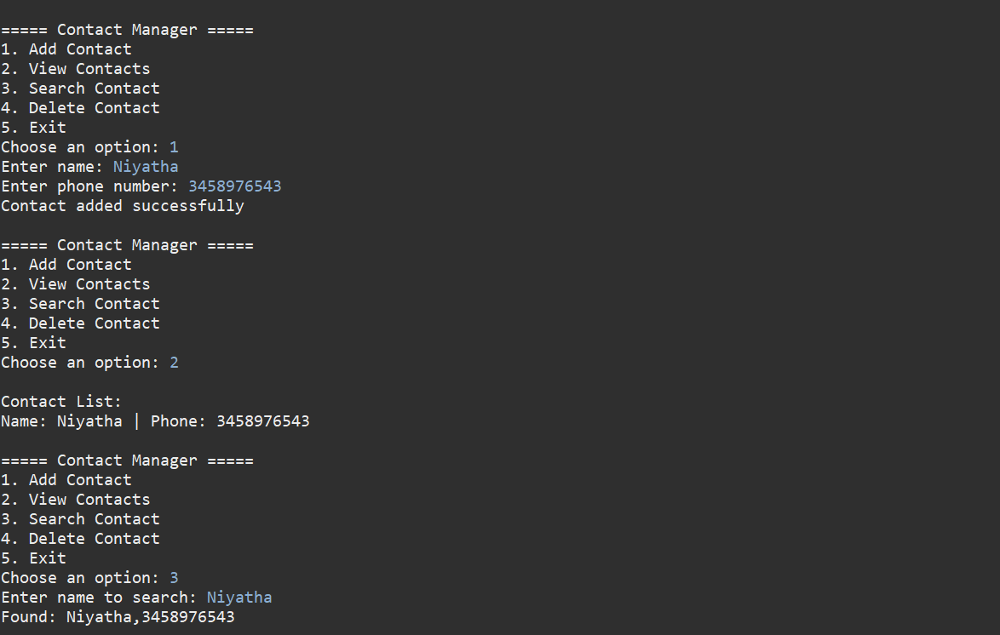
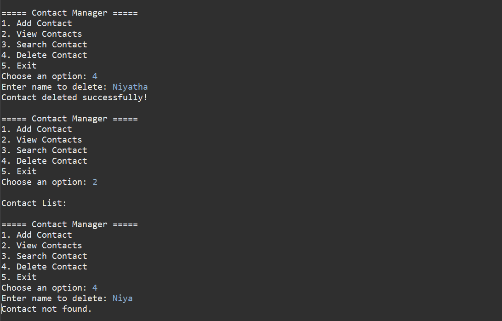

# Simple File-Based Contact Manager

## Problem Statement

Create a Java-based contact management system that stores and manages contacts using a text file.


##  Features

* Add new contacts
* View all saved contacts
* Search contact by name
* Delete contact
* Data stored in a `.txt` file
* Simple menu-driven interface

---

##  Technologies Used

* Java
* File Handling (FileReader, FileWriter, BufferedReader)
* OOP Concepts
* Collections

---

##  How It Works

* Each contact is stored in a file (`contacts.txt`) in the format:

  ```
  name,phone
  ```
* The system reads and writes data using file handling
* A temporary file is used to safely delete contacts

---

##  How to Run

1. Open Eclipse IDE
2. Create a Java Project
3. Add `ContactManager.java`
4. Run as **Java Application**

---

##  Output Screenshots

<div align="center">



<br><br>




</div>

